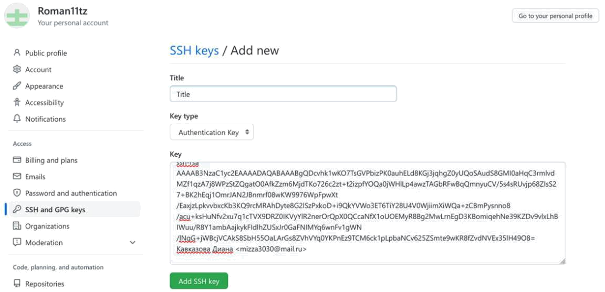
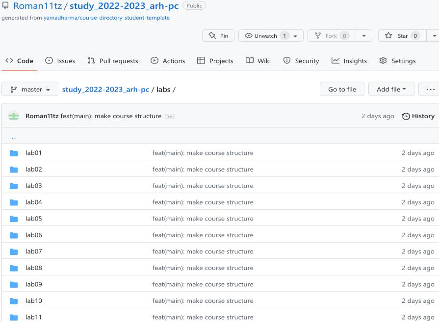

---
## Front matter
title: "Лабораторная работа №2"
subtitle: "Архитектура вычислительных систем"
author: "Кавказова Диана Алексеевна"

## Generic otions
lang: ru-RU
toc-title: "Содержание"

## Bibliography
bibliography: bib/cite.bib
csl: pandoc/csl/gost-r-7-0-5-2008-numeric.csl

## Pdf output format
toc: true # Table of contents
toc-depth: 2
lof: true # List of figures

fontsize: 12pt
linestretch: 1.5
papersize: a4
documentclass: scrreprt
## I18n polyglossia
polyglossia-lang:
  name: russian
  options:
	- spelling=modern
	- babelshorthands=true
polyglossia-otherlangs:
  name: english
## I18n babel
babel-lang: russian
babel-otherlangs: english
## Fonts
mainfont: PT Serif
romanfont: PT Serif
sansfont: PT Sans
monofont: PT Mono
mainfontoptions: Ligatures=TeX
romanfontoptions: Ligatures=TeX
sansfontoptions: Ligatures=TeX,Scale=MatchLowercase
monofontoptions: Scale=MatchLowercase,Scale=0.9
## Biblatex
biblatex: true
biblio-style: "gost-numeric"
biblatexoptions:
  - parentracker=true
  - backend=biber
  - hyperref=auto
  - language=auto
  - autolang=other*
  - citestyle=gost-numeric
## Pandoc-crossref LaTeX customization
figureTitle: "Рис."
tableTitle: "Таблица"
listingTitle: "Листинг"
lofTitle: "Список иллюстраций"
lolTitle: "Листинги"
## Misc options
indent: true
header-includes:
  - \usepackage{indentfirst}
  - \usepackage{float} # keep figures where there are in the text
  - \floatplacement{figure}{H} # keep figures where there are in the text
---

# Цель работы
Изучение идеологии системы контроля версий git и их применение.
Приобретение практических навыков по работе с системой git: создание учётной записи, SSH ключа, рабочего пространства и репозитория курса на основе шаблона и настройка каталога.

# Задание

1. Создайте отчет по выполнению лабораторной работы в соответствующем
каталоге рабочего пространства (labs>lab03>report).
2. Скопируйте отчеты по выполнению предыдущих лабораторных работ в
соответствующие каталоги созданного рабочего пространства.
3. Загрузите файлы на github.

# Выполнение лабораторной работы

Описываются проведённые действия, в качестве иллюстрации даётся ссылка на иллюстрацию (рис. [-@fig:001])

1)Для выполнения работы используем https://github.com/ и создаём учётную запись, заполняя основные данные.:

{ #fig:001 width=90% }

Описываются проведённые действия, в качестве иллюстрации даётся ссылка на иллюстрацию (рис. [-@fig:002])

2)Сначала сделаем предварительную конфигурацию git (совокупность настроек программы, задаваемая пользователем, а также процесс изменения этих настроек в соответствии с нуждами пользователя).
Открываем терминал и вводим следующие команды, указав своё имя и email:

{ #fig:002 width=90% }

Описываются проведённые действия, в качестве иллюстрации даётся ссылка на иллюстрацию (рис. [-@fig:003])

3)Настроим utf-8 в выводе сообщений git (чтобы русские символы были читаемы, необходимо изменить параметр quotepath в секции [core], установив его в false):

{ #fig:003 width=90% }

Описываются проведённые действия, в качестве иллюстрации даётся ссылка на иллюстрацию (рис. [-@fig:004])

4) Зададим имя начальной ветки (будем называть её master):

{ #fig:004 width=90% }

Описываются проведённые действия, в качестве иллюстрации даётся ссылка на иллюстрацию (рис. [-@fig:005])

5)Параметр autocrlf (форматирование и пробелы) : существует проблема переноса строк т. к. Windows при создании файлов использует для обозначения переноса строки два символа «возврат каретки» и «перевод строки», а Linux лишь «перевод строки», поэтому используем значение input, чтобы устранить этот факт.

{ #fig:005 width=90% }

Описываются проведённые действия, в качестве иллюстрации даётся ссылка на иллюстрацию (рис. [-@fig:006])

6) Параметр safecrlf (проверит, что можно откатить изменения (из LF в

CRLF)и предупредит о том, что может случиться что-то нехорошее):

{ #fig:006 width=90% }

Описываются проведённые действия, в качестве иллюстрации даётся ссылка на иллюстрацию (рис. [-@fig:007])

7) Для последующей идентификации пользователя на сервере репозиториев сгенерируем пару ключей (приватный и открытый): с помощью команды ssh-keygen -C "Имя Фамилия <work@mail>"

{ #fig:007 width=90% }

Описываются проведённые действия, в качестве иллюстрации даётся ссылка на иллюстрацию (рис. [-@fig:008])

8) Далее загрузим сгенерированный открытый ключ, зайдя на сайт http://github.org/ под своей учётной записью и перейдём в меню Setting. Псоле этого выберем в боковом меню SSH and GPG keys и нажмём кнопку New SSH key. Скопировав из локальной консоли ключ в буфер обмена cat ~/.ssh/id_rsa.pub | xclip -sel clip , вставим ключ в появившееся на сайте поле и указываем для ключа имя (Title или ДК).

{ #fig:008 width=90% }

Описываются проведённые действия, в качестве иллюстрации даётся ссылка на иллюстрацию (рис. [-@fig:009])

{ #fig:009 width=90% }

Описываются проведённые действия, в качестве иллюстрации даётся ссылка на иллюстрацию (рис. [-@fig:010])

9)Откроем терминал и создадим каталог для предмета «Архитектура компьютера»:

{ #fig:010 width=90% }

Описываются проведённые действия, в качестве иллюстрации даётся ссылка на иллюстрацию (рис. [-@fig:011])

11)Откроем терминал и создадим каталог для предмета «Архитектура компьютера»:

{ #fig:011 width=90% }

Описываются проведённые действия, в качестве иллюстрации даётся ссылка на иллюстрацию (рис. [-@fig:013])

10)Откроем терминал и создадим каталог для предмета «Архитектура компьютера»:

{ #fig:013 width=90% }

Описываются проведённые действия, в качестве иллюстрации даётся ссылка на иллюстрацию (рис. [-@fig:014])

10)Откроем терминал и создадим каталог для предмета «Архитектура компьютера»:

{ #fig:014 width=90% }

Описываются проведённые действия, в качестве иллюстрации даётся ссылка на иллюстрацию (рис. [-@fig:015])

10)Откроем терминал и создадим каталог для предмета «Архитектура компьютера»:

{ #fig:015 width=90% }

Описываются проведённые действия, в качестве иллюстрации даётся ссылка на иллюстрацию (рис. [-@fig:016])

10)Откроем терминал и создадим каталог для предмета «Архитектура компьютера»:

{ #fig:016 width=90% }

Описываются проведённые действия, в качестве иллюстрации даётся ссылка на иллюстрацию (рис. [-@fig:017])

10)Откроем терминал и создадим каталог для предмета «Архитектура компьютера»:

{ #fig:017 width=90% }

# Выполнение самостоятельной работы

Описываются проведённые действия, в качестве иллюстрации даётся ссылка на иллюстрацию (рис. [-@fig:018])

1) Создаю отчет по выполнению лабораторной работы в соответствующем каталоге рабочего пространства, пытаюсь через команду git status чтобы посмотреть состояние ветки и ввожу команду git add . , но из-за превышения дисковой квоты не удаётся выполнить закрепление файла на гитхаб через терминал.

{ #fig:018 width=90% }

Описываются проведённые действия, в качестве иллюстрации даётся ссылка на иллюстрацию (рис. [-@fig:019])

2) Прикрепляю отчёт по первой лабораторной работе в lab1 через веб-сайт. Тоже самое с отчётом по второй работе:

{ #fig:019 width=90% }

Описываются проведённые действия, в качестве иллюстрации даётся ссылка на иллюстрацию (рис. [-@fig:020])

3) Файл удачно сохранился, поэтому тоже самое проделываем со второым отчётом по лабораторной работе. Ссылка: https://github.com/Roman11tz/study_2022-2023_arh-pc/tree/master/labs/lab01/report
    
{ #fig:020 width=90% }

# Выводы

В ходе работы мы изучили идеологии системы контроля версий git и их применение. Приобрели практические навыки по работе с системой git: создание учётной записи, SSH ключа, рабочего пространства и репозитория курса на основе шаблона и настройка каталога.

::: {#refs}
:::
