---
## Front matter
title: "Лабораторная работа №4"
subtitle: "Архитектура вычислительных систем"
author: "Кавказова Диана Алексеевна"

## Generic otions
lang: ru-RU
toc-title: "Содержание"

## Bibliography
bibliography: bib/cite.bib
csl: pandoc/csl/gost-r-7-0-5-2008-numeric.csl

## Pdf output format
toc: true # Table of contents
toc-depth: 2
lof: true # List of figures

fontsize: 12pt
linestretch: 1.5
papersize: a4
documentclass: scrreprt
## I18n polyglossia
polyglossia-lang:
  name: russian
  options:
	- spelling=modern
	- babelshorthands=true
polyglossia-otherlangs:
  name: english
## I18n babel
babel-lang: russian
babel-otherlangs: english
## Fonts
mainfont: PT Serif
romanfont: PT Serif
sansfont: PT Sans
monofont: PT Mono
mainfontoptions: Ligatures=TeX
romanfontoptions: Ligatures=TeX
sansfontoptions: Ligatures=TeX,Scale=MatchLowercase
monofontoptions: Scale=MatchLowercase,Scale=0.9
## Biblatex
biblatex: true
biblio-style: "gost-numeric"
biblatexoptions:
  - parentracker=true
  - backend=biber
  - hyperref=auto
  - language=auto
  - autolang=other*
  - citestyle=gost-numeric
## Pandoc-crossref LaTeX customization
figureTitle: "Рис."
tableTitle: "Таблица"
listingTitle: "Листинг"
lofTitle: "Список иллюстраций"
lolTitle: "Листинги"
## Misc options
indent: true
header-includes:
  - \usepackage{indentfirst}
  - \usepackage{float} # keep figures where there are in the text
  - \floatplacement{figure}{H} # keep figures where there are in the text
---

# Цель работы

Освоение процедуры компиляции и сборки программ, написанных на ассем-
блере NASM.

# Задание

1. В соответствующем каталоге сделайте отчёт по лабораторной работе №4 
в формате Markdown. В качестве отчёта необходимо предоставить отчёты
в 3 форматах: pdf, docx и md.
2. Загрузите файлы на github.

# Теоретическое введение

Здесь описываются теоретические аспекты, связанные с выполнением работы.

Например, в табл. [-@tbl:std-dir] приведено краткое описание стандартных каталогов Unix.

: Описание некоторых каталогов файловой системы GNU Linux {#tbl:std-dir}

| Имя каталога | Описание каталога                                                                                                          |
|--------------|----------------------------------------------------------------------------------------------------------------------------|
| `/`          | Корневая директория, содержащая всю файловую                                                                               |
| `/bin `      | Основные системные утилиты, необходимые как в однопользовательском режиме, так и при обычной работе всем пользователям     |
| `/etc`       | Общесистемные конфигурационные файлы и файлы конфигурации установленных программ                                           |
| `/home`      | Содержит домашние директории пользователей, которые, в свою очередь, содержат персональные настройки и данные пользователя |
| `/media`     | Точки монтирования для сменных носителей                                                                                   |
| `/root`      | Домашняя директория пользователя  `root`                                                                                   |
| `/tmp`       | Временные файлы                                                                                                            |
| `/usr`       | Вторичная иерархия для данных пользователя                                                                                 |

Более подробно об Unix см. в [@gnu-doc:bash;@newham:2005:bash;@zarrelli:2017:bash;@robbins:2013:bash;@tannenbaum:arch-pc:ru;@tannenbaum:modern-os:ru].

# Выполнение лабораторной работы

1) Создаём каталог для работы с программами на языке ассемблера NASM:

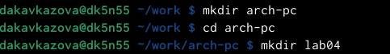{ #fig:001 width=90% }

2) Создаём текстовый файл с именем hello.asm и открываем этот файл с помощью любого текстового редактора gedit

{ #fig:002 width=90% }

{ #fig:003 width=90% }

3) Вводим в него следующий текст:

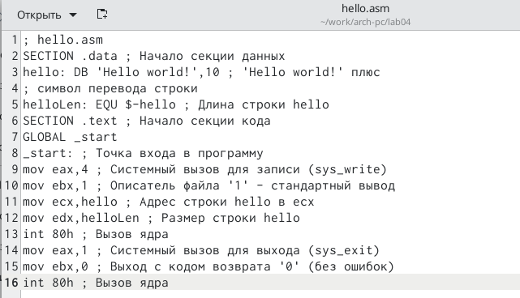{ #fig:004 width=90% }

4)NASM превращает текст программы в объектный код. Например, для компиля-
ции приведённого выше текста программы «Hello World» необходимо написать следующее:

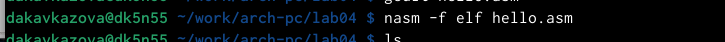{ #fig:005 width=90% }

5)Т. к. текст программы набран без ошибок, транслятор преобразует текст
программы из файла hello.asm в объектный код, который записался в файл hello.o.

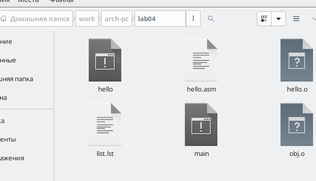{ #fig:006 width=90% }

6) С помощью команды ls проверим, что объектный файл был создан.  У нас есть два файла hello.asm и  hello.o.

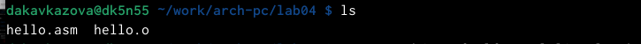{ #fig:007 width=90% }

7) Следующая команда скомпилирует исходный файл hello.asm в obj.o , при этом
формат выходного файла будет elf, и в него будут включены символы для
отладки (опция -g), кроме того, создается файл листинга list.lst .Выполним следующую команду:

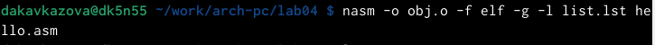{ #fig:008 width=90% }

8) С помощью команды ls проверим, что файлы были созданы:

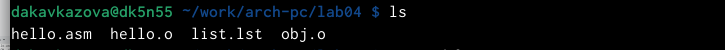{ #fig:009 width=90% }

10)Для получения списка форматов объектного файла смотрим nasm -hf.

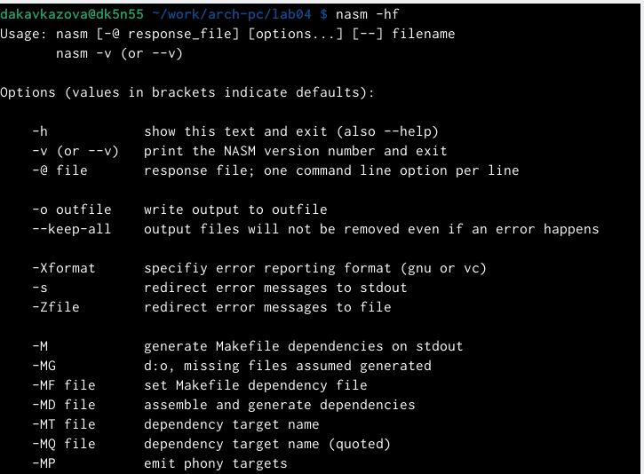{ #fig:010 width=90% }

11)Чтобы получить исполняемую программу, объектный файл необходимо передать на обработку компоновщику, а потом с командой ls проверим содержимое:

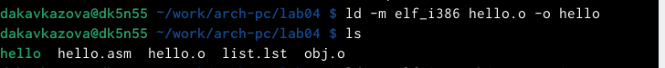{ #fig:011 width=90% }

12) Ключ -o с последующим значением задаст в данном случае имя создаваемого исполняемого файла. Выполним следующую команду:

{ #fig:012 width=90% }

11)Запустим на выполнение созданный исполняемый файл, находящийся в текущем каталоге, набрав в командной строке  ./hello:

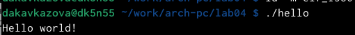{ #fig:013 width=90% }

# Выполнение самостоятельной работы
1) В каталоге ~/work/arch-pc/lab04 с помощью команды cp создали копию файла hello.asm с именем lab04.asm.

{ #fig:111 width=95% }

2) С помощью текстового редактора внесли изменения в текст программы в файле lab04.asm так, чтобы вместо Hello world! на экран выводилась строка с фамилией и именем. Для этого вместо "Hello world" пишу "Kavkazova Diana".

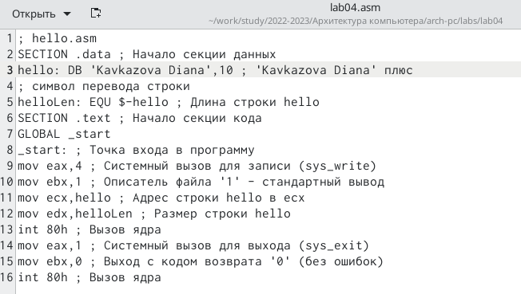{ #fig:222 width=95% }

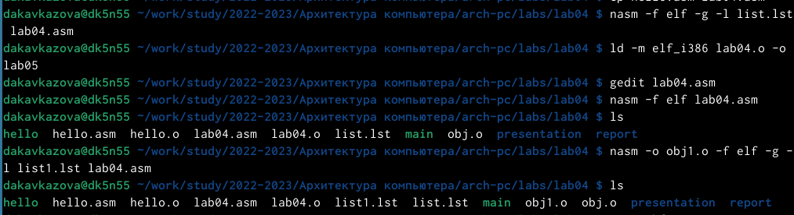{ #fig:223 width=95% }

3) Оттранслируем полученный текст программы lab04.asm в объектный файл и запустим, получим вывод фамилии и имя. 

{ #fig:333 width=95% }

4) Загружаю файлы на GitHub при помощи команд "git add .", "git commit -am "" ", "git push".

# Выводы

Я освоила процедуру компиляции и сборки программ, написанных на ассемблере NASM (рассмотрела пример простой программы, научилась изменять внутрисодержимое файла, приобрела навык по созданию объектных файлов).

# Список литературы{.unnumbered}

::: {#refs}
:::
